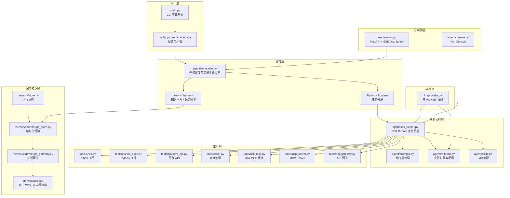

<div align="center">

```
  ██╗     ██╗███╗   ██╗ ██████╗       ██╗  ██╗██╗
  ██║     ██║████╗  ██║██╔════╝       ╚██╗██╔╝██║
  ██║     ██║██╔██╗ ██║██║  ███╗█████╗ ╚███╔╝ ██║
  ██║     ██║██║╚██╗██║██║   ██║╚════╝ ██╔██╗ ██║
  ███████╗██║██║ ╚████║╚██████╔╝      ██╔╝ ██╗██║
  ╚══════╝╚═╝╚═╝  ╚═══╝ ╚═════╝       ╚═╝  ╚═╝╚═╝
```

**LingXi — 自主渗透测试智能体**

_Autonomous Penetration Testing Intelligence_

[](./LICENSE)
[](https://www.python.org/)
[](https://fastapi.tiangolo.com/)
[](https://www.langchain.com/)

源自腾讯安全 Hackathon「智能渗透主战场 / 零界论坛赛道」的 LLM 驱动多 Agent 渗透辅助框架

</div>

---

## 目录

- [项目简介](#项目简介)
- [技术栈](#技术栈)
- [系统架构](#系统架构)
- [核心特性](#核心特性)
- [运行模式](#运行模式)
- [项目结构](#项目结构)
- [快速开始](#快速开始)
- [环境变量说明](#环境变量说明)
- [CTF Writeup 知识库](#ctf-writeup-知识库)
- [扩展能力](#扩展能力)
- [Web Dashboard](#web-dashboard)
- [部署建议](#部署建议)
- [验证与测试](#验证与测试)
- [参考项目与致谢](#参考项目与致谢)
- [许可证](#许可证)

---

## 项目简介

LingXi 是一个 LLM 驱动的自主渗透测试 Agent 框架，围绕"自动拉题 / 侦察 / 工具执行 / 策略纠偏 / Flag 提交 / 经验沉淀"的闭环设计，源自腾讯安全 Hackathon 比赛项目。

当前仓库保留核心架构，遵循"核心开源 + 扩展私有"的边界：

- 保留 LingXi 名称与腾讯比赛项目背景
- 不保留历史 Git 记录
- 不附带论坛官方工具包、私有 PoC、Sliver 资产、运行日志、数据库或知识库快照
- 缺失本地扩展时，核心路径以"待命模式 + 可观察 + 可开发 + 可测试"方式工作

当前默认执行链路为 `agent/sdk_runner.py` 中的 SDK Runner 体系。

---

## 技术栈

| 层级 | 技术 | 用途 |
|------|------|------|
| Agent 框架 | Claude Code SDK + LangChain | Agent 编排、工具调用、多轮对话 |
| LLM Provider | DeepSeek / Anthropic / OpenAI / SiliconFlow | 多 Provider 适配 + 自动 Failover |
| Web 框架 | FastAPI + SSE | REST API + 实时推送 Dashboard |
| 向量存储 | Milvus Lite / Qdrant | CTF Writeup 向量检索 |
| 容器化 | Docker / Docker Compose | Kali 执行环境 |
| 工具协议 | MCP (Model Context Protocol) | Kali / Forum / Sliver 工具桥接 |
| 终端输出 | Rich | 结构化 Console 日志 |

---

## 系统架构

LingXi 延续 Planner / Executor / Reflector 的认知分层，从入口层到可观察层逐层解耦。下图展示核心数据流与模块依赖关系：



### 双 Agent 协作模型

| 角色 | 职责 | 绑定工具 | 模型 |
|------|------|----------|------|
| **Main Agent（主攻手）** | 直接执行侦察、验证、利用、提交与收敛 | 题型相关工具、Kali、可选 MCP | 可配置 |
| **Advisor Agent（顾问）** | 在卡点、失败累积或高价值分支上做一次性纠偏与策略建议 | 无直接攻击工具，偏策略分析 | 可配置 |
| **Reflector（反思器）** | 对失败路径做分层归因，帮助主链路转向 | 无 | 复用顾问链路 |

---

## 核心特性

**智能执行能力**

- 自动化主链路：拉题、侦察、执行、提交、复盘形成闭环
- 多模式运行：支持主战场、双开、仅 Web、仅独立子模式
- 自动侦察：端口、HTTP 指纹、页面上下文、错误回显等基础线索提纯
- 多执行手段协同：Shell、Python、Kali、平台 API、可选 MCP 扩展
- 进度感知：支持基于分数/Flag 状态做任务级收敛

**分层知识系统**

- 运行记忆层：同题 / 同 scope 的热路径回放
- 结构化经验层：高价值成功链路与失败归因写回
- 外部知识层：`ctf_writeups_kb/` 提供可控检索与 API 服务
- 门控策略：本地经验优先于外部参考

**鲁棒性**

- Flag 快路径提交 / 危险行为约束 / 重复低价值路径拦截
- API 退避与恢复 / 写回线程安全 / 缺少私有扩展时优雅降级
- 主机 Failover：主备端点自动切换，阈值触发

**可观察性**

- Rich Console 实时输出
- FastAPI + SSE Web Dashboard
- 调度状态、日志轨迹、任务控制可视化

**Provider 与容灾**

- 支持多 Provider 角色拆分（DeepSeek / Anthropic / OpenAI / SiliconFlow）
- 主攻手 / 顾问链路隔离 / 备用端点切换 / 可选论坛独立模型链路
- `_EndpointGate` 限流器抑制重试风暴

---

## 运行模式

主入口为根目录 `main.py`：

```bash
python main.py                    # 默认主战场链路
python main.py --all              # 主战场 + 灵境/零界双开
python main.py --web              # 主战场 + Web Dashboard
python main.py --all --web        # 双开 + Dashboard
python main.py --web-only         # 仅启动 Web Dashboard
python main.py --main-only        # 仅启动主链路独立进程
python main.py --forum-only       # 仅启动论坛扩展链路（需本地扩展）
python main.py --web --port 7890  # 指定 Dashboard 端口
```

说明：
- 未配置 `COMPETITION_BASE_URL` / `COMPETITION_API_BASE_URL` 时，程序进入待命模式
- 待命模式下 Dashboard 依然可用，适合本地开发、配置校验与文档化演示
- 论坛、PoC、Sliver 等扩展默认关闭，需本地挂接后才会启用

---

## 项目结构

```text
LingXi/
├── main.py                         # 主入口（CLI 参数解析、调度循环）
├── config.py                       # 全局配置管理（7 个嵌套 dataclass）
├── runtime_env.py                  # Python 解释器与 .venv 统一解析
├── start_daemon.sh                 # 后台守护启动脚本
├── requirements.txt                # 运行依赖
├── .env.example                    # 环境变量模板
├── LICENSE                         # GPL-3.0 许可证
│
├── host_failover.py                # 主机主备切换（阈值触发）
├── kali_container.py               # Kali 容器自动发现
├── challenge_fingerprints.py       # 题目产品指纹识别（10 种产品）
├── level2_task_hints.py            # Level2 任务 CVE-PoC 映射
├── log_utils.py                    # 日志工具（文件解析、敏感信息脱敏）
├── mock_platform_server.py         # 模拟平台服务器（测试用）
│
├── agent/                          # Agent 核心
│   ├── sdk_runner.py               #   SDK Runner 主执行器（当前默认链路）
│   ├── sdk_solver.py               #   SDK 求解器
│   ├── scheduler.py                #   任务调度与实例生命周期
│   ├── prompts.py                  #   系统提示词体系（4 套模板）
│   ├── reflector.py                #   失败归因与反思
│   ├── skills.py                   #   技能与扩展装配（1724 行）
│   ├── console.py                  #   Rich Console 输出
│   └── main_battle_progress.py     #   主战场进度追踪
│
├── tools/                          # 工具层
│   ├── shell.py                    #   Shell 执行器
│   ├── python_exec.py              #   Python 执行器
│   ├── platform_api.py             #   平台 API 客户端
│   ├── recon.py                    #   自动侦察
│   ├── kali_mcp.py                 #   Kali MCP 桥接
│   ├── kali_tool_proxy.py          #   Kali 工具代理
│   ├── mcp_server.py               #   MCP Server
│   ├── api_gateway.py              #   API 网关
│   ├── api_gateway_monitor.py      #   API 网关监控
│   ├── flag_utils.py               #   Flag 提取与提交工具
│   ├── forum_api.py                #   论坛扩展桥接（17 个 LangChain 工具）
│   ├── forum_history_bootstrap.py  #   论坛历史数据引导
│   ├── forum_message_state.py      #   论坛消息状态管理
│   ├── level2_cve_poc.py           #   本地 PoC 扩展桥接
│   └── sliver_mcp.py               #   Sliver MCP 桥接
│
├── llm/                            # LLM Provider 适配
│   └── provider.py                 #   多 Provider + Failover + 限流
│
├── memory/                         # 记忆与知识系统
│   ├── store.py                    #   运行记忆存储（JSON 文件）
│   ├── knowledge_store.py          #   结构化经验存储（22 字段 schema）
│   ├── knowledge_gateway.py        #   知识网关（门控策略）
│   ├── knowledge_service.py        #   知识服务 API（uvicorn 子进程）
│   └── knowledge_writeback.py      #   经验回写（持久化队列 + 后台 Worker）
│
├── web/                            # Web Dashboard
│   ├── server.py                   #   FastAPI + SSE 实时推送
│   └── static/                     #   前端静态资源
│       ├── index.html
│       └── app.js
│
├── ctf_writeups_kb/                # CTF Writeup 知识库子项目
│   ├── src/ctf_kb/                 #   核心库（爬虫/RAG/向量存储/API/CLI）
│   ├── tests/                      #   知识库测试
│   ├── offline_ingest.py           #   离线数据导入
│   └── scraper.py                  #   Writeup 爬取
│
├── docker/                         # Kali 容器化执行环境
│   ├── docker-compose.yml          #   Docker Compose 编排
│   └── Dockerfile.kali             #   Kali 镜像定义
│
├── tests/                          # 测试（25 个文件）
│   ├── test_sdk_runner.py          #   SDK Runner 测试
│   ├── test_scheduler.py           #   调度器测试
│   ├── test_llm_failover.py        #   LLM Failover 测试
│   ├── test_memory_knowledge.py    #   记忆知识测试
│   ├── test_main_battle_multi_flag_logic.py
│   ├── test_main_dispatch_budget.py
│   ├── test_prompt_rendering.py
│   ├── test_prompt_strategy.py
│   ├── test_skill_contexts.py
│   ├── test_web_knowledge_cleaning.py
│   └── ...                         #   其他单元/集成测试
│
├── extensions/                     # 本地可选扩展挂载点（仓库不附带私有实现）
│   ├── forum/                      #   论坛扩展
│   ├── level2-pocs/                #   私有 PoC 扩展
│   ├── skills/                     #   本地技能目录
│   └── additional-skills/          #   额外技能目录
│
├── SECURITY.md                     # 安全说明
└── CONTRIBUTING.md                 # 贡献说明
```

---

## 快速开始

### 1. 环境要求

| 依赖 | 是否必需 | 说明 |
|------|----------|------|
| Python 3.11+ | 必需 | 推荐使用 venv |
| 至少一组 LLM API Key | 必需 | 主攻手/顾问需能正常响应 |
| Docker / Docker Desktop | 可选 | 用于 Kali 工作流 |
| Kali 容器 | 可选 | 仓库保留 Docker/Kali 执行层 |

### 2. 安装依赖

```bash
# 创建虚拟环境
python -m venv .venv

# 激活虚拟环境
source .venv/bin/activate        # Linux / macOS
# .venv\Scripts\Activate.ps1     # Windows PowerShell

# 安装依赖
python -m pip install --upgrade pip
python -m pip install -r requirements.txt
```

### 3. 配置环境变量

```bash
cp .env.example .env
```

编辑 `.env`，至少配置以下项：

```env
# 平台地址（留空进入待命模式）
COMPETITION_BASE_URL=
COMPETITION_API_BASE_URL=

# 平台认证
AGENT_TOKEN=your-agent-token

# 主攻手 LLM
MAIN_LLM_PROVIDER=openai
OPENAI_BASE_URL=https://api.openai.com/v1
OPENAI_API_KEY=your-openai-key
OPENAI_MODEL=gpt-4o-mini

# 顾问 LLM
ADVISOR_LLM_PROVIDER=anthropic
ANTHROPIC_BASE_URL=https://api.anthropic.com
ANTHROPIC_API_KEY=your-anthropic-key
ANTHROPIC_MODEL=claude-3-5-sonnet-latest

# Docker / Kali
DOCKER_ENABLED=true

# 可选扩展（默认关闭）
FORUM_ENABLED=false
SLIVER_ENABLED=false
```

### 4. 启动 Docker / Kali（可选）

```bash
cd docker && docker compose up -d
```

如果只验证主程序、Dashboard、记忆和知识层，可跳过此步。

### 5. 启动 LingXi

```bash
# 待命模式 + Web Dashboard
python main.py --web --port 7890

# 默认主战场链路
python main.py

# 主战场 + 灵境/零界双开
python main.py --all

# 双开 + Dashboard
python main.py --all --web
```

---

## 环境变量说明

以下为 `.env.example` 中所有可用配置项。留空即为待命模式，不影响核心启动。

### 平台与认证

| 变量 | 说明 | 默认值 |
|------|------|--------|
| `COMPETITION_BASE_URL` | 平台展示入口 URL | 留空（待命模式） |
| `COMPETITION_API_BASE_URL` | 平台 API 入口 URL | 留空（待命模式） |
| `COMPETITION_SERVER_HOST` | 平台主机地址 | 同 `COMPETITION_API_BASE_URL` |
| `COMPETITION_SERVER_HOST_FALLBACK` | 平台备用主机 | 留空 |
| `AGENT_TOKEN` | 平台统一认证令牌 | 需显式配置 |

### LLM Provider

角色分配：`MAIN_LLM_PROVIDER`（主攻手）、`ADVISOR_LLM_PROVIDER`（顾问）、`FORUM_LLM_PROVIDER`（论坛链路）。

**通用格式** — 每个 Provider 均支持 `_BASE_URL` / `_API_KEY` / `_MODEL` 三元组：

| Provider | 环境变量前缀 | 默认模型 |
|----------|-------------|----------|
| DeepSeek | `DEEPSEEK_` | `deepseek-chat` |
| Anthropic | `ANTHROPIC_` | `claude-3-5-sonnet-latest` |
| OpenAI | `OPENAI_` | `gpt-4o-mini` |
| SiliconFlow | `SILICONFLOW_` | `Qwen/Qwen3-32B` |

**Failover 备用端点**（可选，格式同上）：

| 变量前缀 | 说明 |
|----------|------|
| `OPENAI_FALLBACK_` | OpenAI 备用端点 |
| `MAIN_FALLBACK_` | 主攻手备用端点 |
| `ADVISOR_FALLBACK_` | 顾问备用端点 |
| `FORUM_FALLBACK_` | 论坛链路备用端点 |
| `FORUM_LLM_` | 论坛独立模型链路 |

### Docker / Kali

| 变量 | 说明 | 默认值 |
|------|------|--------|
| `DOCKER_ENABLED` | 是否启用 Kali Docker 执行环境 | `true` |
| `DOCKER_CONTAINER_NAME` | Kali 容器名 | `kali-pentest` |
| `DDDD2_PATH` | DDDD2 工具路径 | `./dddd2` |

### 扩展（默认关闭）

| 变量 | 说明 | 默认值 |
|------|------|--------|
| `FORUM_ENABLED` | 论坛扩展链路 | `false` |
| `SERVER_HOST` / `SERVER_HOST_FALLBACK` | 论坛扩展入口 | 留空 |
| `SLIVER_ENABLED` | Sliver 扩展 | `false` |
| `SLIVER_CLIENT_PATH` / `_CONFIG` / `_ROOT_DIR` | Sliver 路径配置 | 见 `.env.example` |
| `SLIVER_AUTO_ENABLE_IF_PRESENT` | 检测到 Sliver 时自动启用 | `false` |

### Agent 运行时

| 变量 | 说明 | 默认值 |
|------|------|--------|
| `MAX_ATTEMPTS` | 单题最大尝试数 | `70` |
| `INITIAL_ATTEMPT_BUDGET` | 初始尝试预算 | `50` |
| `RETRY_ATTEMPT_BUDGET_STEP` | 重试预算递增步长 | `10` |
| `MAX_CONCURRENT_TASKS` | 主链路并发任务数 | `8` |
| `SINGLE_TASK_TIMEOUT` | 单题超时秒数 | `1800` |
| `MAX_RETRIES` | 最大重试次数 | `4` |
| `RETRY_BACKOFF_SECONDS` | 失败退避秒数 | `60` |
| `FETCH_INTERVAL_SECONDS` | 拉题间隔秒数 | `600` |
| `SCHEDULE_TICK_SECONDS` | 调度心跳间隔 | `5` |
| `LING_XI_IDLE_FETCH_SECONDS` | 空闲拉题间隔 | `3` |
| `LING_XI_BUSY_FETCH_SECONDS` | 忙碌拉题间隔 | `30` |
| `LING_XI_UNSAFE_RAW_LOGS` | 输出原始日志（调试用） | `0` |

### Advisor / 控制

| 变量 | 说明 | 默认值 |
|------|------|--------|
| `CONSECUTIVE_FAILURES_THRESHOLD` | 触发顾问咨询的连续失败数 | `3` |
| `ADVISOR_CONSULTATION_INTERVAL` | 顾问咨询间隔 | `0` |
| `ATTEMPT_HISTORY_LIMIT` | 尝试历史保留数 | `3` |
| `ENABLE_ROLE_SWAP_RETRY` | 启用角色切换重试 | `true` |
| `TOOL_LOOP_BREAK_THRESHOLD` | 工具循环打断阈值 | `20` |
| `ADVISOR_NO_TOOL_ROUNDS_THRESHOLD` | 顾问无工具轮次阈值 | `2` |

### SDK

| 变量 | 说明 | 默认值 |
|------|------|--------|
| `SDK_MODEL` | SDK 主模型 | `claude-3-5-sonnet-latest` |
| `SDK_ADVISOR_MODEL` | SDK 顾问模型 | `claude-3-5-haiku-latest` |
| `SDK_PERMISSION_MODE` | SDK 权限模式 | `bypassPermissions` |

### 知识服务

| 变量 | 说明 | 默认值 |
|------|------|--------|
| `KNOWLEDGE_SERVICE_ENABLED` | 允许拉起知识服务 | `false` |
| `KNOWLEDGE_SERVICE_HOST` | 知识服务监听地址 | `127.0.0.1` |
| `KNOWLEDGE_SERVICE_PORT` | 知识服务端口 | `8791` |

### 自动提示

| 变量 | 说明 | 默认值 |
|------|------|--------|
| `AUTO_FETCH_HINT` | 自动获取提示 | `false` |
| `AUTO_HINT_ON_RETRY_LEVEL` | 自动提示触发的重试级别 | `2` |

---

## CTF Writeup 知识库

`ctf_writeups_kb/` 是外部知识库子项目，职责：

- 采集和整理可公开来源的 CTF Writeup
- 构建 embedding / 检索 / 轻量索引链路（Milvus / Qdrant）
- 提供 CLI / HTTP API 两种访问方式
- 为顾问链路提供受控外部参考

数据流：

```text
公开来源 / manifest
    ↓
writeups_raw.jsonl（本地生成）
    ↓
normalize / dedupe / chunk
    ↓
writeups_index.jsonl（本地生成）
    ↓
Milvus Lite / Qdrant（本地生成）
    ↓
KnowledgeService / Gateway
    ↓
Advisor / API / CLI
```

注意：当前仓库只附带代码、测试和 `data/source_library_cn.json`。`writeups_raw.jsonl`、`writeups_index.jsonl`、`milvus.db`、`qdrant/` 均为本地生成产物，不随仓库发布。

---

## 扩展能力

当前仓库保留扩展接口，不附带私有实现。

### Docker / Kali

仓库保留 `docker/`、`tools/kali_mcp.py`、`tools/kali_tool_proxy.py`，适用于 Kali 容器中的工具执行。没有 Docker 时不影响待命模式、Dashboard、记忆和知识层。

### MCP

`requirements.txt` 已包含 `mcp` 依赖。`tools/forum_api.py`、`tools/sliver_mcp.py`、`tools/kali_mcp.py` 保留桥接层，无本地扩展或目标服务时默认不启用。

### 技能目录

支持本地挂接以下扩展目录：

- `extensions/skills/` — 本地技能
- `extensions/additional-skills/` — 额外技能
- `extensions/forum/` — 论坛扩展
- `extensions/level2-pocs/` — 私有 PoC

这些目录在仓库中默认不存在或为空，可自行挂接私有扩展，但不应提交回仓库。

### 论坛 / PoC / Sliver

论坛、Level2 PoC、Sliver 三者默认关闭，缺失时不影响基础运行。

---

## Web Dashboard

Web 面板是可选组件，基于 FastAPI + SSE 实现实时推送。

```bash
python main.py --web                # 主链路 + Dashboard
python main.py --web --port 7890    # 指定端口
python main.py --web-only           # 仅启动 Dashboard
```

功能：

- 任务、赛区状态与调度结果实时观察
- 实时日志流与执行轨迹
- 手动创建 / 暂停 / 恢复 / 中止任务
- 记忆与知识中心浏览

---

## 部署建议

### 方式一：直接运行

```bash
git clone https://github.com/adrian803/LingXi.git
cd LingXi
python -m venv .venv && source .venv/bin/activate
python -m pip install --upgrade pip && python -m pip install -r requirements.txt
cp .env.example .env
python main.py --web
```

### 方式二：带 Docker/Kali

```bash
python -m venv .venv && source .venv/bin/activate
python -m pip install -r requirements.txt
docker compose -f docker/docker-compose.yml up -d
python main.py --web
```

### 方式三：后台守护

```bash
bash start_daemon.sh --web
bash start_daemon.sh --status
bash start_daemon.sh --logs
```

建议先跑通 `venv + 待命模式 + Dashboard`，再按需补 Docker/Kali、MCP、技能目录或私有扩展。

---

## 验证与测试

上线前建议至少做以下检查：

```bash
# 编译检查
python -m py_compile main.py agent/sdk_runner.py agent/skills.py tools/forum_api.py tools/level2_cve_poc.py web/server.py

# 单元/集成测试
python -m unittest tests.test_memory_knowledge
python -m unittest tests.test_forum_host_fallback
python -m unittest tests.test_level2_poc_tool
python -m unittest tests.test_main_battle_multi_flag_logic
python -m unittest tests.test_prompt_rendering
python -m unittest tests.test_sdk_runner
python -m unittest ctf_writeups_kb.tests.test_api_search
```

---

## 参考项目与致谢

LingXi 的实现参考了以下项目或技术栈：

- [Claude Code SDK](https://github.com/anthropics/claude-code-sdk-python)
- [LangChain](https://github.com/langchain-ai/langchain)
- [FastAPI](https://github.com/tiangolo/fastapi)
- [Rich](https://github.com/Textualize/rich)
- [MCP](https://github.com/modelcontextprotocol/python-sdk)
- [pymilvus](https://github.com/milvus-io/pymilvus) / [Qdrant](https://github.com/qdrant/qdrant-client)

---

## 许可证

本仓库采用 [GPL-3.0-only](./LICENSE) 许可证。

---

<div align="center">

_心有灵犀一点通 — 以 AI 之智，破万千屏障_

</div>
